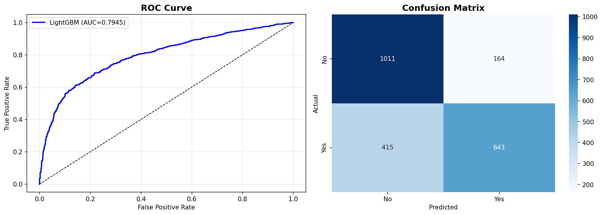

# Bank Marketing - Vadeli Mevduat Tahmini

Zero2End Machine Learning Bootcamp - Uctan Uca ML Projesi

## Proje Aciklamasi

Bu proje, bir Portekiz bankasinin telefon pazarlama kampanyasinda musterilerin **vadeli mevduat** (term deposit) acip acmayacagini tahmin eden bir makine ogrenmesi sistemidir.

Banka pazarlama ekipleri, hangi musterilerin vadeli mevduat acma olasiliginin yuksek oldugunu onceden bilerek, kampanya kaynaklarini daha verimli kullanabilir ve donusum oranlarini artirabilir.

## Demo

Uygulamayi denemek icin: [Canlı Demo (Hugging Face)](https://huggingface.co/spaces/f0rknturkoglu/bank-marketing-prediction)

## Ekran Goruntuleri



## Sektor ve Problem

- **Sektor:** Bankacilik
- **Problem:** Pazarlama Kampanyasi Basari Tahmini
- **Hedef:** Musterinin vadeli mevduat acip acmayacagini tahmin etmek (Binary Classification)
- **Is Degeri:** Kampanya maliyetlerini dusurme, donusum oranlarini artirma

## Veri Seti

- **Kaynak:** Kaggle - Bank Marketing Dataset
- **Link:** https://www.kaggle.com/datasets/janiobachmann/bank-marketing-dataset
- **Orijinal Kaynak:** UCI Machine Learning Repository
- **Boyut:** ~45.000 satir, 17 sutun
- **Target:** deposit (yes/no)

### Feature Aciklamalari

| Feature | Tip | Aciklama |
|---------|-----|----------|
| age | Numerik | Musteri yasi |
| job | Kategorik | Meslek turu |
| marital | Kategorik | Medeni durum |
| education | Kategorik | Egitim seviyesi |
| default | Kategorik | Kredi temerrut durumu |
| balance | Numerik | Yillik ortalama bakiye (euro) |
| housing | Kategorik | Konut kredisi var mi? |
| loan | Kategorik | Bireysel kredi var mi? |
| contact | Kategorik | Iletisim turu |
| day | Numerik | Son iletisim gunu |
| month | Kategorik | Son iletisim ayi |
| duration | Numerik | Son gorusme suresi (saniye) |
| campaign | Numerik | Bu kampanyada yapilan arama sayisi |
| pdays | Numerik | Onceki kampanyadan bu yana gecen gun |
| previous | Numerik | Onceki kampanyalarda yapilan arama sayisi |
| poutcome | Kategorik | Onceki kampanya sonucu |
| deposit | Target | Vadeli mevduat acti mi? (yes/no) |

## Pipeline ve Metodoloji

1. **EDA (Exploratory Data Analysis)**
   - Veri inceleme ve gorsellestirme
   - Target dagilimi analizi
   - Feature korelasyonlari

2. **Baseline Model**
   - LightGBM ile baseline
   - Cross-validation

3. **Feature Engineering**
   - Yas gruplari
   - Bakiye kategorileri
   - Kampanya etkililigi metrikleri

4. **Model Optimizasyonu**
   - Optuna ile hiperparametre arama
   - Model karsilastirmasi

5. **Model Degerlendirme**
   - Feature importance
   - SHAP analizi
   - Business threshold optimizasyonu

## Metrikler

| Metrik | Baseline (Duration ile) | Final Model (Gerçekçi) | Fark |
|--------|----------|-------------|---------|
| AUC    | 0.9259   | 0.7828      | -15.45% |
| Accuracy | 86.07% | 72.59%      | -15.66% |
| Precision | 82.97%| 75.34%      | -9.19%  |
| Recall | 88.85%   | 62.67%      | -29.47% |

## Kullanilan Teknolojiler

- Python 3.10+
- pandas, numpy
- scikit-learn
- LightGBM
- Optuna
- SHAP
- FastAPI
- Gradio

## Kurulum

### Gereksinimler

- Python 3.10 veya uzeri
- pip

### Adimlar

1. Repoyu klonlayin:
```bash
git clone https://github.com/f0rknturkoglu/zero2endMLbootcamp.git
cd zero2endMLbootcamp
```

2. Virtual environment olusturun:
```bash
python -m venv venv
source venv/bin/activate  # Linux/Mac
```

3. Bagimliliklari yukleyin:
```bash
pip install -r requirements.txt
```

4. Uygulamayi calistirin:
```bash
# API
python src/app.py

# Gradio arayuzu
python src/app.py gradio
```

## Repo Yapisi

```
zero2endMLbootcamp/
    .gitignore
    README.md
    requirements.txt
    data/
        raw/
            bank.csv
        processed/
    notebooks/
        01_eda.ipynb
        02_baseline.ipynb
        03_feature_engineering.ipynb
        04_model_optimization.ipynb
        05_model_evaluation.ipynb
        06_final_pipeline.ipynb
    src/
        __init__.py
        config.py
        inference.py
        pipeline.py
        app.py
    models/
        final/
    docs/
    tests/
```

## Onemli Notlar

### Duration Feature Hakkinda

`duration` (gorusme suresi) feature'i model performansini onemli olcude etkiler, ancak **production ortaminda bu bilgi gorusme yapilmadan once bilinmez**. Bu nedenle:

- Arastirma/gelistirme asamasinda kullanilabilir
- Production modelinde **cikarilmalidir**
- Business raporlamada bu duruma dikkat cekilmelidir

## Iletisim

- **GitHub:** https://github.com/f0rknturkoglu

## Lisans

Bu proje MIT lisansi altinda lisanslanmistir.
